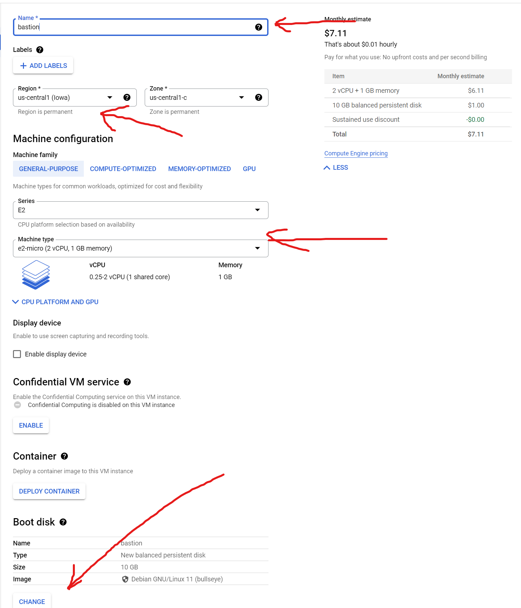

# Lecture 05 otus Introduction with GCP (via KodeKloud Playground)

* Create user account in GCP (use KodeKloud Playground)
* Create instances VM in web-interface and connecting to they via SSH
* Consider the options for connecting to hosts via bastion host and VPN

## Create new branch cloud-bastion in github repositor (devops_study_infra)

git checkout -b cloud-bastion

## Login to GCP

1. Login to KodeKloude.
2. Select Playground.
3. Create privat tab in browser.
    * copy to private tab link to playground (Ctrl + Shift + N)
    * copy Username
    * copy Password
4. Select country (Georgia in my case).
5. Select a project
    * Select from organization (CLOUDLABSGCPORG2.COM)
    * Select project clgcporg2-116 
  
6. Select Compute Engine 
7. After creation select Settings-Metadata-SSH keys 
8. Create on your Linux/Unix system ssh-key.
    * ssh-keygen -t rsa -f ~/.ssh/appuser -C appuser -P ""
    * Private key ~/.ssh/appuser
    * Public key ~/.ssh/appuser.pub
9. Copy content from ~/.ssh/appuser.pub to our project .
    * If ssh-key in Metadate project, this applies to all VM machines in the project
    * Can be overriden when creating VM
    * Can be block when creating VM
10. Create default route in VPC network
    * Destination IP 0.0.0.0/0 
11. Create firewall rule 
    * use your IP address
    * or allow all IP 0.0.0.0/0
    * set rule targets "All instances in the network" 
    * set protocol tcp port 22
    * save rule
    * QUESTION: How to specify ip address?
12. Create instance VM
    * Hostname: Bastion
    * Region: us-central
    * Machine Type: e2-micro 
    * Boot disk: Ubuntu - lastversion 
    * Allow HTTP&HTTPS traffic 
13. Open Advanced option and setup networking 
14. Create VM
    * Check that your VM appeared in the Firewall rule you created
    * If appeared check ssh connection  you should see the VM terminal
