# Lecture 05 otus Introduction with GCP (via KodeKloud Playground)

* Create user account in GCP (use KodeKloud Playground)
* Create instances VM in web-interface and connecting to they via SSH
* Consider the options for connecting to hosts via bastion host and VPN

## Create new branch cloud-bastion in github repositor (devops_study_infra)

git checkout -b cloud-bastion

## Login to GCP

1. Login to KodeKloude.

2. Select Playground.

3. Create privat tab in browser.
    * copy to private tab link to playground (Ctrl + Shift + N)
    * copy Username
    * copy Password

4. Select country (Georgia in my case).

5. Select a project
    * Select from organization (CLOUDLABSGCPORG2.COM)
    * Select project clgcporg2-116 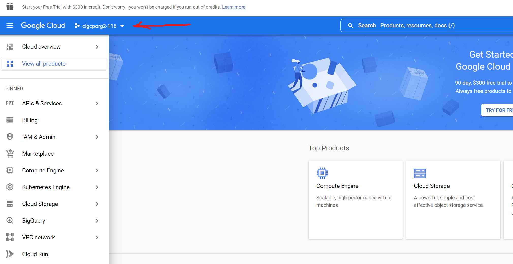
  
6. Select Compute Engine 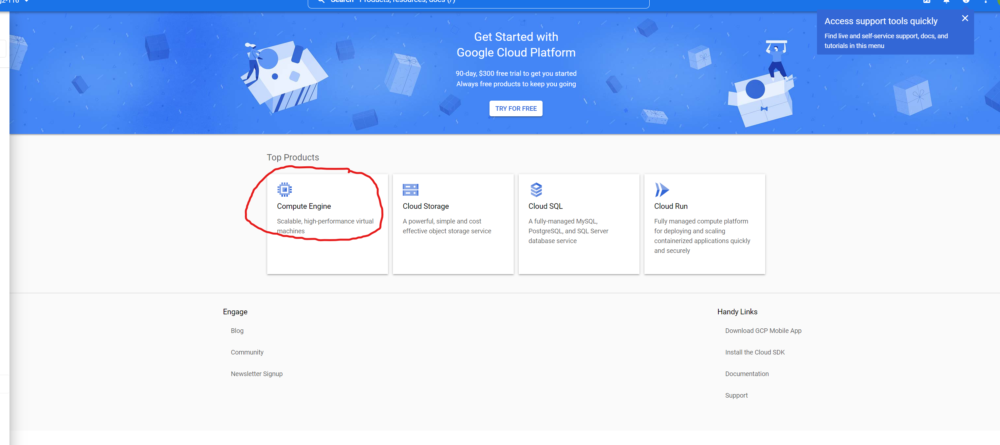

7. After creation select Settings-Metadata-SSH keys 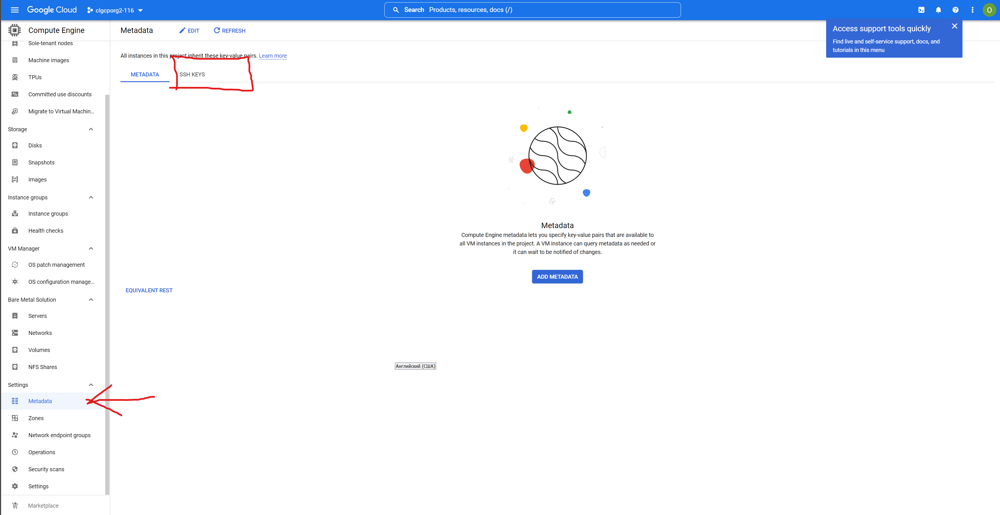

8. Create on your Linux/Unix system ssh-key.
    * `ssh-keygen -t rsa -f ~/.ssh/appuser -C appuser -P ""`
    * `Private key ~/.ssh/appuser`
    * `Public key ~/.ssh/appuser.pub`

9. Copy content from `~/.ssh/appuser.pub` to our project .
    * If ssh-key in Metadate project, this applies to all VM machines in the project
    * Can be overriden when creating VM
    * Can be block when creating VM

10. Create default route in VPC network
    * Destination IP 0.0.0.0/0 

11. Create firewall rule
    * use your IP address
    * or allow all IP 0.0.0.0/0
    * set rule targets "All instances in the network" 
    * set protocol tcp port 22
    * save rule
    * QUESTION: How to specify ip address?

12. Create instance VM
    * Hostname: Bastion
    * Region: us-central
    * Machine Type: e2-micro 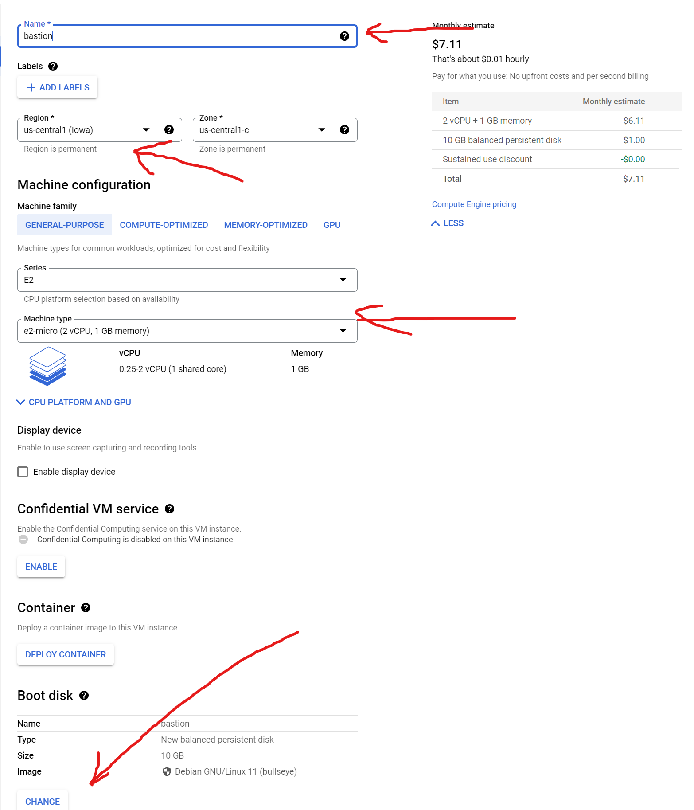
    * Boot disk: Ubuntu - lastversion 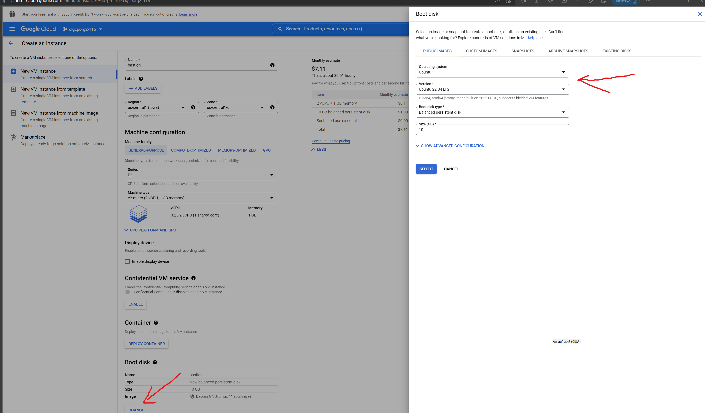
    * Allow HTTP&HTTPS traffic 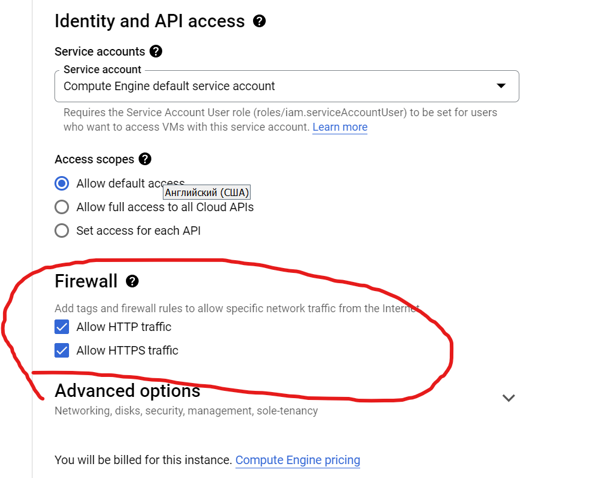

13. Open Advanced option and setup networking like on screenshot

14. Create VM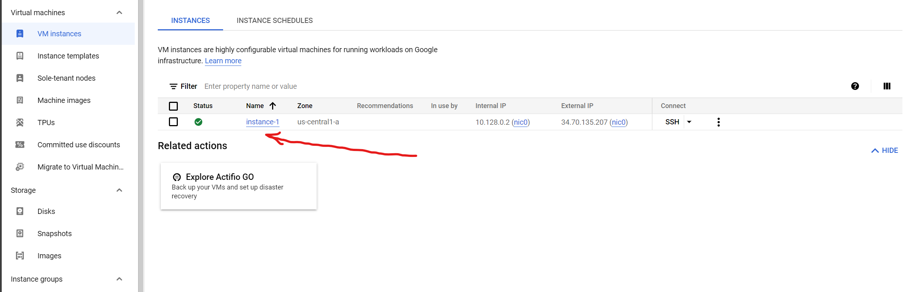
    * Check that your VM appeared in the Firewall rule you created 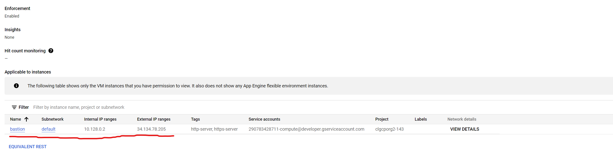
    * If appeared check ssh connection  you should see the VM terminal

15. try to connect to bastion with terminal linux and using early created ssh key
    * `ssh -i ~/.ssh/appuser appuser@externalIpAddrBastion` 

## Second internal-host

1. Create second VM without external network 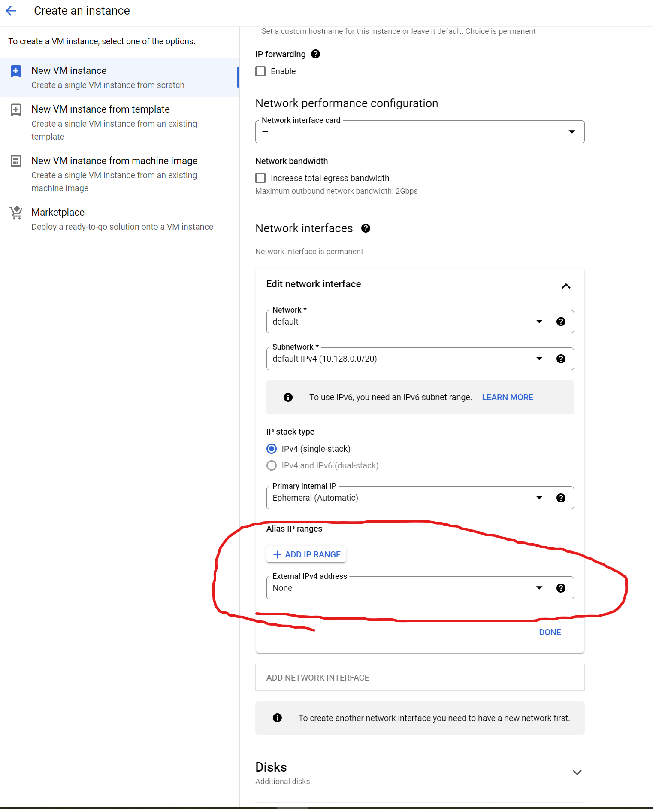

2. Check 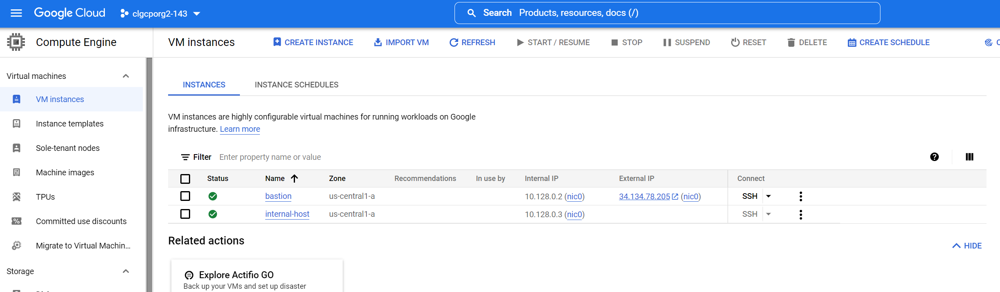

3. try to connect to bastion (Item 9), and then in bastion terminal try to connect to internal-host
    * if you setup firewall allow only your IP, you need add internal IP your bastion setting in firewall rule or create new firewall rule with this IP address
    * `$ ssh internalIp` 
    * if all right you see "permission denied" 

4. Setup Bastion host for direct connection internalnetwork GCP
    * in localhost (your PC/laptop) setup SSH Forwarding
      * ```$ eval `ssh-agent``
      * `$ ssh-add -L` (check ssh-agent list)
      * `$ ssh-add ~/.ssh/appuser` (add to ssh-agent list your ssh private key)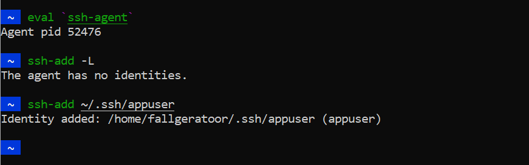
    * try to connection to internal-host via bastion
      * `$ ssh -i ~/.ssh/appuser -A appuser@bastionIp`
      * `$ ssh internal-host-ip` 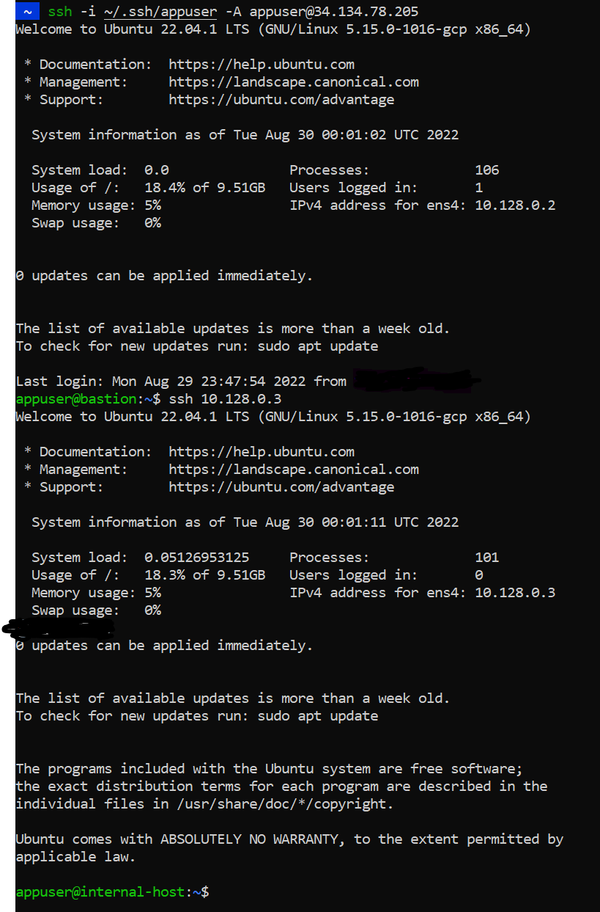
    * make sure that you are on the right host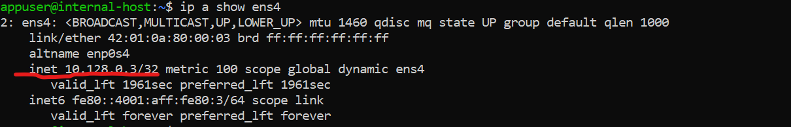

5. one-command connection to the internal host ssh -J appuser@bastionIp appuser@internalHostIp

6. create in `~/.zshrc` function
   * before edit "~/.zshrc", create backup this file
   * `nano ~/.zshrc`
   * type text: sshotus () {
eval `ssh-agent`
ssh-add ~/.ssh/appuser
ssh -J appuser@ip-bastion appuser@ip-internal-host
} 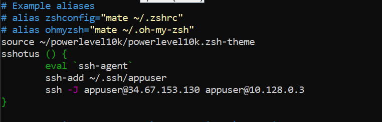

7. save changes and restart terminal to make the function avalible

8. try to connect use function-alias `sshotus` 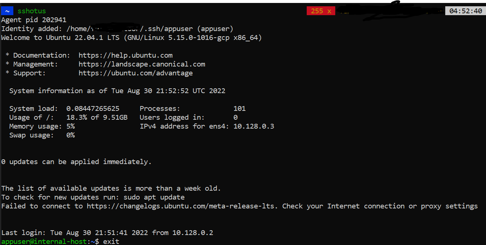
