# Lecture 05 otus Introduction with GCP (via KodeKloud Playground)

* Create user account in GCP (use KodeKloud Playground)
* Create instances VM in web-interface and connecting to they via SSH
* Consider the options for connecting to hosts via bastion host and VPN

## Create new branch cloud-bastion in github repositor (devops_study_infra)

git checkout -b cloud-bastion

## Login to GCP

1. Login to KodeKloude.

2. Select Playground.

3. Create privat tab in browser.
    * copy to private tab link to playground (Ctrl + Shift + N)
    * copy Username
    * copy Password

4. Select country (Georgia in my case).

5. Select a project
    * Select from organization (CLOUDLABSGCPORG2.COM)
    * Select project clgcporg2-116 
  
6. Select Compute Engine 

7. After creation select Settings-Metadata-SSH keys 

8. Create on your Linux/Unix system ssh-key.
    * `ssh-keygen -t rsa -f ~/.ssh/appuser -C appuser -P ""`
    * `Private key ~/.ssh/appuser`
    * `Public key ~/.ssh/appuser.pub`

9. Copy content from `~/.ssh/appuser.pub` to our project 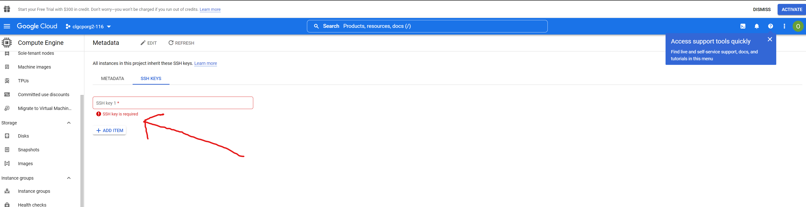.
    * If ssh-key in Metadate project, this applies to all VM machines in the project
    * Can be overriden when creating VM
    * Can be block when creating VM

10. Create default route in VPC network
    * Destination IP 0.0.0.0/0 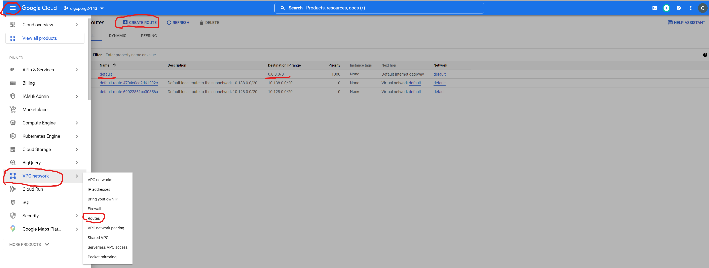

11. Create firewall rule
    * use your IP address
    * or allow all IP 0.0.0.0/0
    * set rule targets "All instances in the network" 
    * set protocol tcp port 22
    * save rule
    * QUESTION: How to specify ip address?

12. Create instance VM
    * Hostname: Bastion
    * Region: us-central
    * Machine Type: e2-micro 
    * Boot disk: Ubuntu - ver. 20.04 (because 22.04 not work with MongoDB at the time of creating this instruction)  
    * Allow HTTP&HTTPS traffic 
    * Add network tags `bastion`

13. Open Advanced option and setup networking like on screenshot

14. Create VM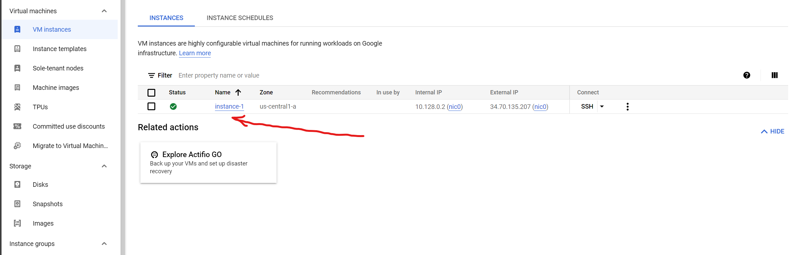
    * Check that your VM appeared in the Firewall rule you created 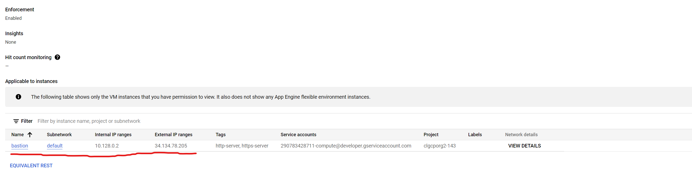
    * If appeared check ssh connection  you should see the VM terminal

15. try to connect to bastion with terminal linux and using early created ssh key
    * `ssh -i ~/.ssh/appuser appuser@externalIpAddrBastion` 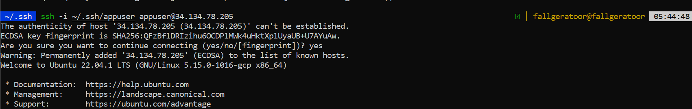

## Second internal-host

1. Create second VM without external network 

2. Check 

3. try to connect to bastion (Item 9), and then in bastion terminal try to connect to internal-host
    * if you setup firewall allow only your IP, you need add internal IP your bastion setting in firewall rule or create new firewall rule with this IP address
    * `$ ssh internalIp` 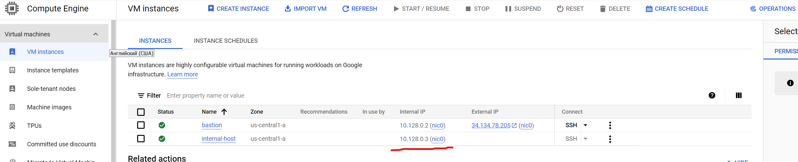
    * if all right you see "permission denied" 

4. Setup Bastion host for direct connection internalnetwork GCP
    * in localhost (your PC/laptop) setup SSH Forwarding
      * ```$ eval `ssh-agent```
      * `$ ssh-add -L` (check ssh-agent list)
      * `$ ssh-add ~/.ssh/appuser` (add to ssh-agent list your ssh private key)
    * try to connection to internal-host via bastion
      * `$ ssh -i ~/.ssh/appuser -A appuser@bastionIp`
      * `$ ssh internal-host-ip` 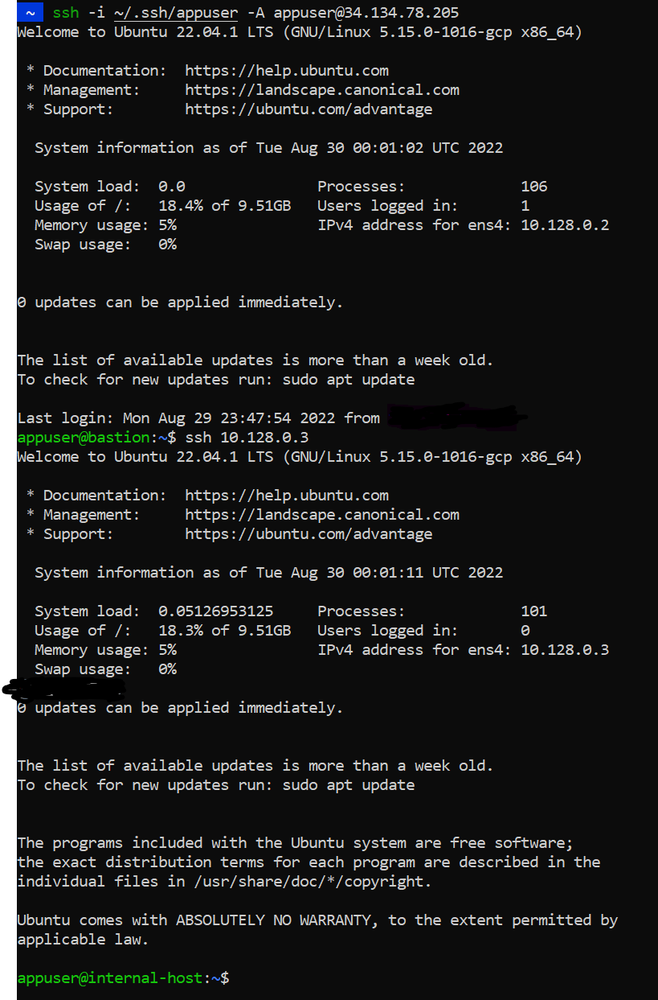
    * make sure that you are on the right host

5. one-command connection to the internal host ssh -J appuser@bastionIp appuser@internalHostIp

6. add in `~/.ssh/appuser` on your localhost next:
   * before edit, create backup this file
   * change IPAddres to yours
   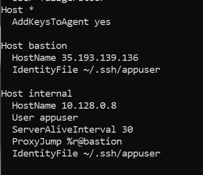
  
7. save changes and restart terminal to make the function avalible

8. try to connect use function-alias `internal` 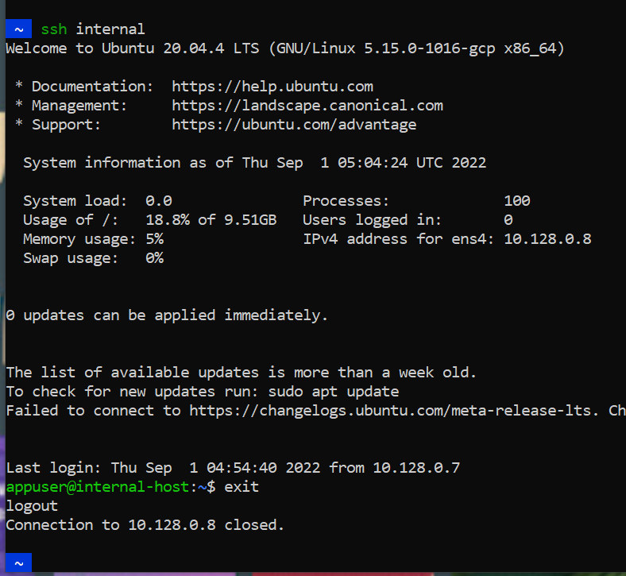

## Create VPN sever for GCP

1. Login to bastion via ssh
2. Create bash script file: `touch setupvpn.sh`
3. Use text editor and write the following lines to the file

    ```bash

    sudo tee /etc/apt/sources.list.d/pritunl.list << EOF
    deb <http://repo.pritunl.com/stable/apt> focal main
    EOF
    sudo apt --assume-yes install gnupg
    gpg --keyserver hkp://keyserver.ubuntu.com --recv-keys 7568D9BB55FF9E5287D586017AE645C0CF8E292A
    gpg --armor --export 7568D9BB55FF9E5287D586017AE645C0CF8E292A | sudo tee /etc/apt/trusted.gpg.d/pritunl.asc
    wget -qO - <https://www.mongodb.org/static/pgp/server-6.0.asc> | sudo apt-key add -
    echo "deb [ arch=amd64,arm64 ] <https://repo.mongodb.org/apt/ubuntu> focal/mongodb-org/6.0 multiverse" | sudo tee /etc/apt/sources.list.d/mongodb-org-6.0.  list
    sudo apt update
    sudo apt install -y mongodb-org pritunl
    sudo systemctl start mongod pritunl
    sudo systemctl enable mongod pritunl

    ```

4. Execute: `sudo bash setupvpn.sh`

5. After execution check service status
    * sudo systemctl status mongod
    * sudo systemctl status pritunl 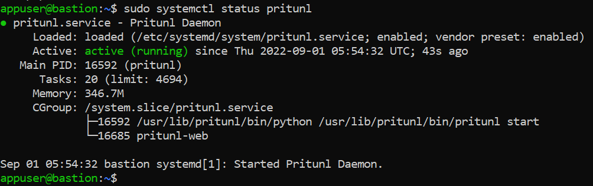

6. In your browser open refer
    `https://bastionIPAddress/setup`
7. Ignore warning 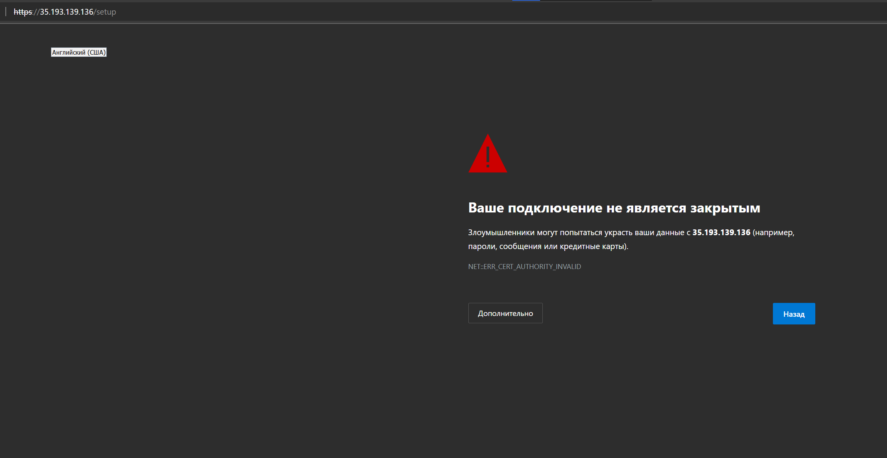
8. Open bastion terminal and execute instruction from pritunl page 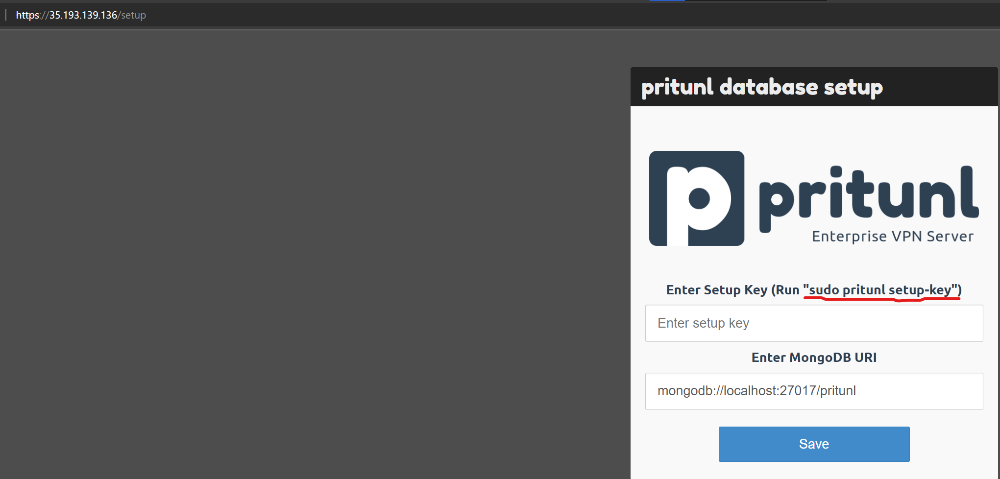
9. Copy-paste created key and save 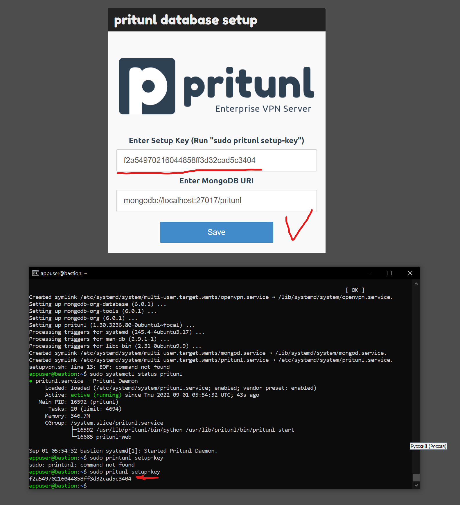
10. Ignore warning
11. Execute in bastion terminal: sudo pritunl default-password
    * copy-paste login and password
    * sign in 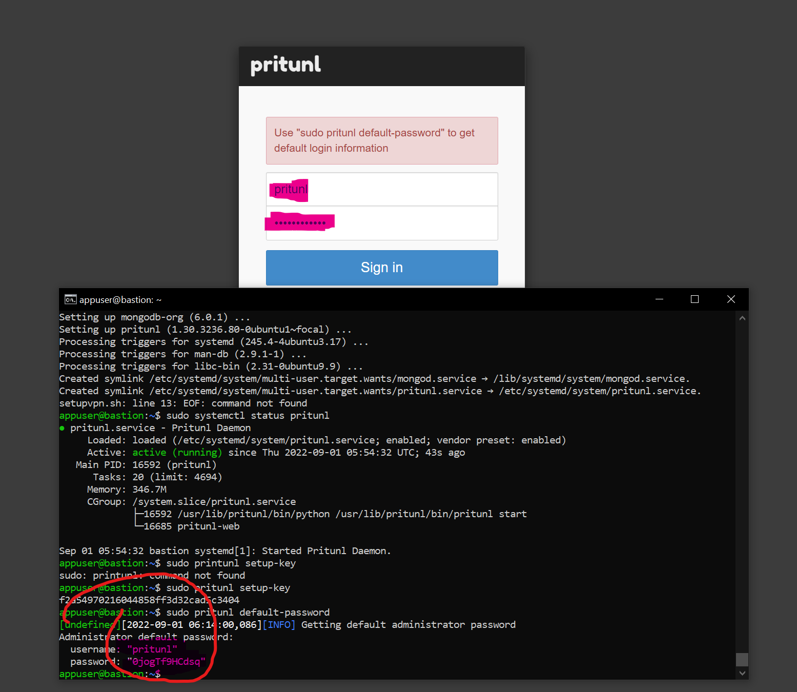
12. initial setup
    * setup username (test) and password (6214157507237678334670591556762) 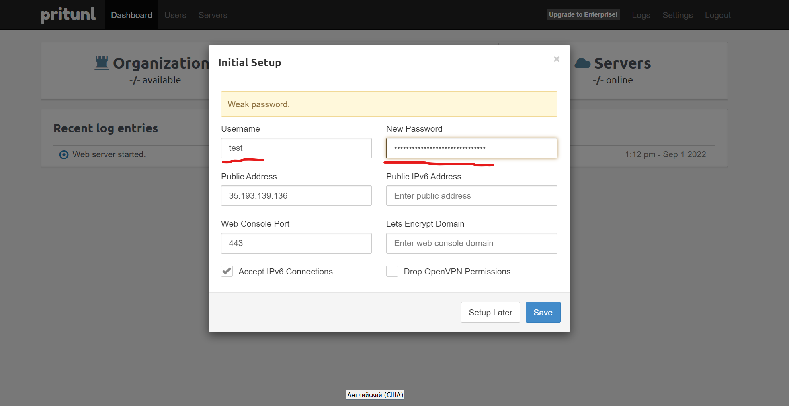
    * save

13. Add organization and user (Usetname: test, pin: 6214157507237678334670591556762 ) 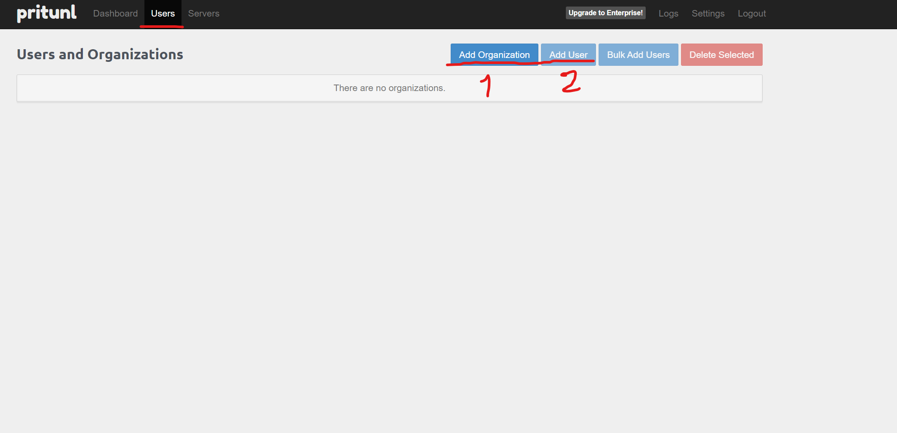
    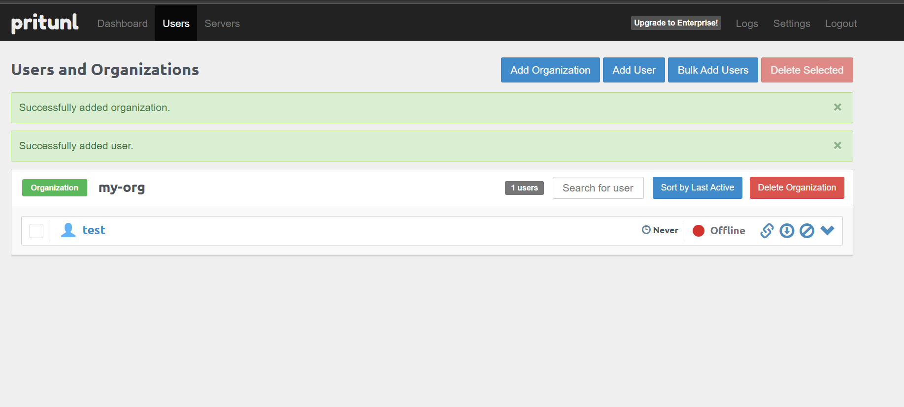
14. Create server
    * name - test
    * remember port 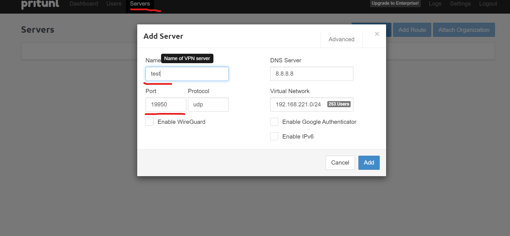
15. Attach created organization to server and start server 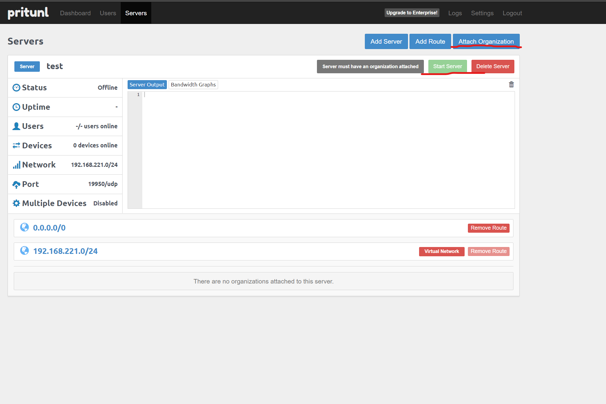

16. Create firewall rule in VPC Network GCP use tag  `bastion` and this tag to your `bastion` VM   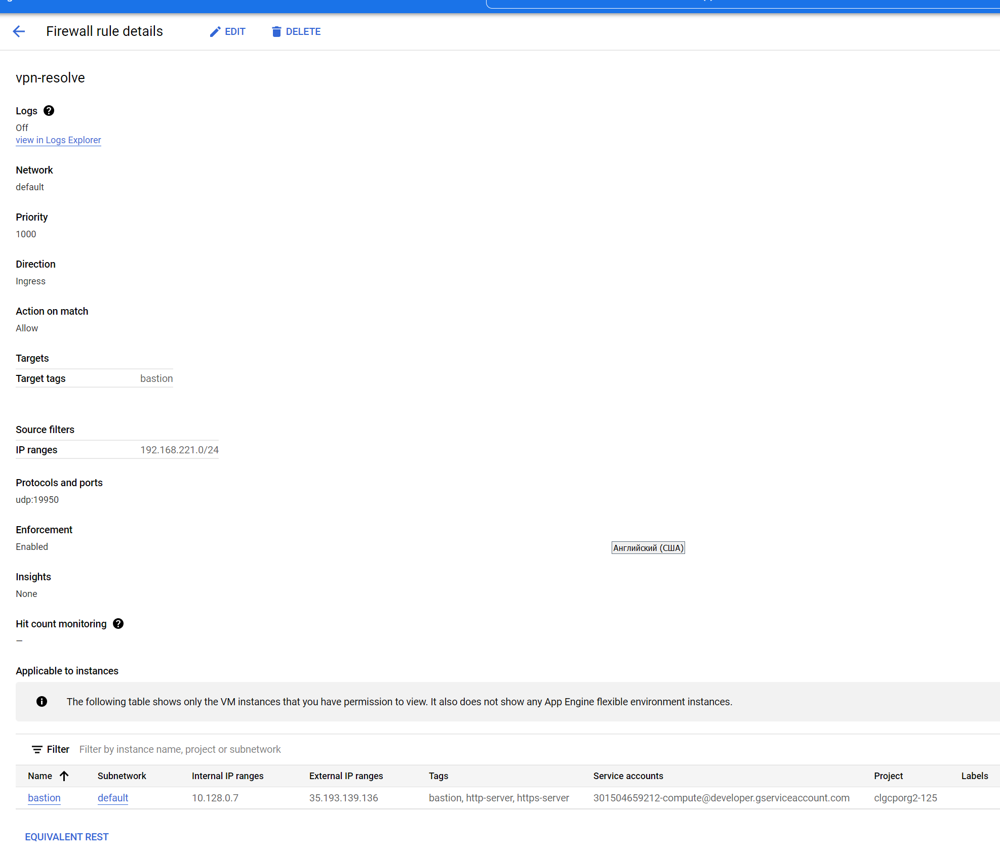
17. Download archive contained *.ovpn 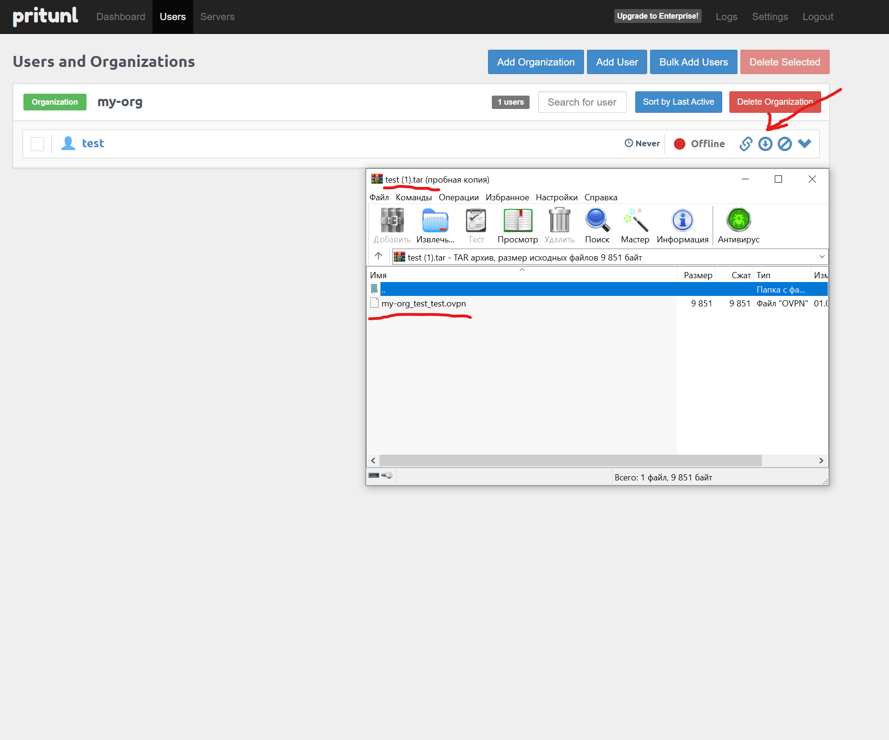
18. In your localhost terminal add config `*.ovpn` to openvpn : `sudo openvpn *.ovpn`

19. Open new terminal and check connection througth bastion VPN server. `sudo ssh -i ~/.ssh/appuser appuser@10.128.0.8`

## TLS certificate for pritunl

1. use ssh and login to bastion
2. install snapd
3. `sudo snap install core`
4. `sudo snap refresh core`
5. `sudo apt-get remove certbot`
6. `sudo snap install --classic certbot`
7. `sudo ln -s /snap/bin/certbot /usr/bin/certbot`
8. `shutdown your webservice sudo systemctl stop pritunl`
9. `sudo certbot certonly --standalone -d BastionIPAddress.nip.io`
10. install created certificate to webaplication
11. `sudo certbot renew --dry-run`
