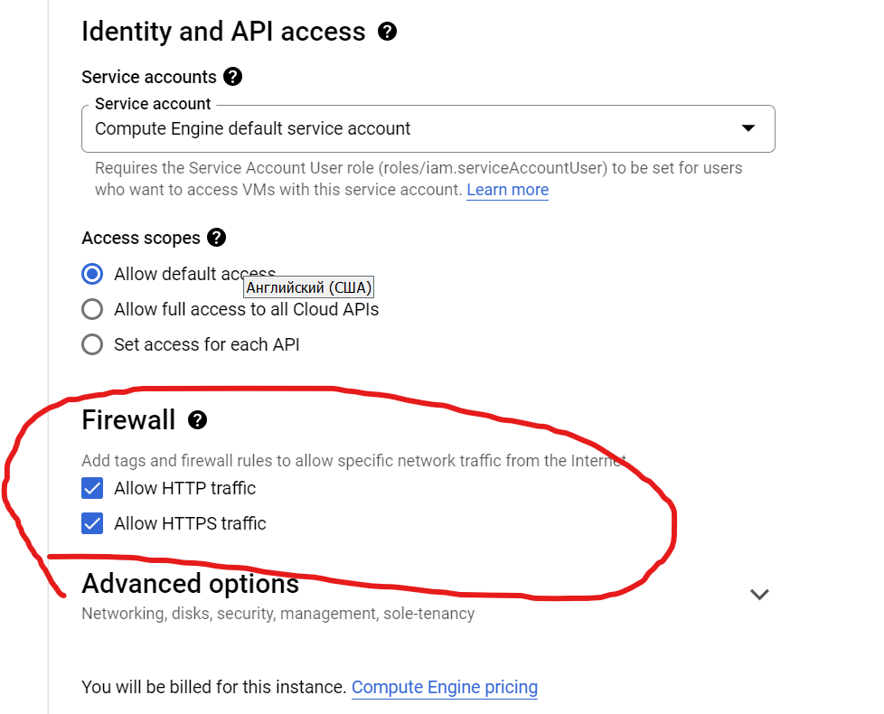
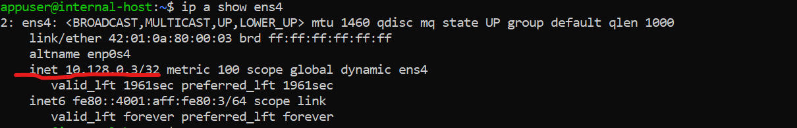

# Otus/KodeKloud

## Lecture 05 otus Introduction with GCP (via KodeKloud Playground)

* Create user account in GCP (use KodeKloud Playground)
* Create instances VM in web-interface and connecting to they via SSH
* Consider the options for connecting to hosts via bastion host and VPN

### Create new branch cloud-bastion in github repository (devops_study_infra)

git checkout -b cloud-bastion

### Login to GCP

1. Login to KodeKloud.

2. Select Playground.

3. Create private tab in browser.
    * copy to private tab link to playground (Ctrl + Shift + N)
    * copy Username
    * copy Password

4. Select country (Georgia in my case).

5. Select a project
    * Select from organization (CLOUDLABSGCPORG2.COM)
    * Select project clgcporg2-116 
  
6. Select Compute Engine 

7. After creation select Settings-Metadata-SSH keys 

8. Create on your Linux/Unix system ssh-key.
    * `ssh-keygen -t rsa -f ~/.ssh/appuser -C appuser -P ""`
    * `Private key ~/.ssh/appuser`
    * `Public key ~/.ssh/appuser.pub`

9. Copy content from `~/.ssh/appuser.pub` to our project .
    * If ssh-key in Metadate project, this applies to all VM machines in the project
    * Can be override when creating VM
    * Can be block when creating VM

10. Create default route in VPC network
    * Destination IP 0.0.0.0/0 

11. Create firewall rule
    * use your IP address
    * or allow all IP 0.0.0.0/0
    * set rule targets "All instances in the network" 
    * set protocol tcp port 22
    * save rule
    * QUESTION: How to specify ip address?

12. Create instance VM
    * Hostname: Bastion
    * Region: us-central
    * Machine Type: e2-micro 
    * Boot disk: Ubuntu - ver. 20.04 (because 22.04 not work with MongoDB at the time of creating this instruction)  
    * Allow HTTP&HTTPS traffic 
    * Add network tags `bastion`

13. Open Advanced option and setup networking like on screenshot

14. Create VM
    * Check that your VM appeared in the Firewall rule you created 
    * If appeared check ssh connection  you should see the VM terminal

15. try to connect to bastion with terminal linux and using early created ssh key
    * `ssh -i ~/.ssh/appuser appuser@externalIpAddrBastion` 

### Second internal-host

1. Create second VM without external network 

2. Check 

3. try to connect to bastion (Item 9), and then in bastion terminal try to connect to internal-host
    * if you setup firewall allow only your IP, you need add internal IP your bastion setting in firewall rule or create new firewall rule with this IP address
    * `$ ssh internalIp` 
    * if all right you see "permission denied" 

4. Setup Bastion host for direct connection internal network GCP
    * in localhost (your PC/laptop) setup SSH Forwarding
      * ```$ eval `ssh-agent```
      * `$ ssh-add -L` (check ssh-agent list)
      * `$ ssh-add ~/.ssh/appuser` (add to ssh-agent list your ssh private key)
    * try to connection to internal-host via bastion
      * `$ ssh -i ~/.ssh/appuser -A appuser@bastionIp`
      * `$ ssh internal-host-ip` 
    * make sure that you are on the right host

5. one-command connection to the internal host ssh -J appuser@bastionIp appuser@internalHostIp

6. add in `~/.ssh/appuser` on your localhost next:
   * before edit, create backup this file
   * change IPAddress to yours
  
   
  
7. save changes and restart terminal to make the function available

8. try to connect use function-alias `internal` 

### Create VPN sever for GCP

1. Login to bastion via ssh
2. Create file setupvpn.sh
3. Use text editor and write the following lines to the file

    ```bash

    sudo tee /etc/apt/sources.list.d/pritunl.list << EOF
    deb <http://repo.pritunl.com/stable/apt> focal main
    EOF
    sudo apt --assume-yes install gnupg
    gpg --keyserver hkp://keyserver.ubuntu.com --recv-keys 7568D9BB55FF9E5287D586017AE645C0CF8E292A
    gpg --armor --export 7568D9BB55FF9E5287D586017AE645C0CF8E292A | sudo tee /etc/apt/trusted.gpg.d/pritunl.asc
    wget -qO - <https://www.mongodb.org/static/pgp/server-6.0.asc> | sudo apt-key add -
    echo "deb [ arch=amd64,arm64 ] <https://repo.mongodb.org/apt/ubuntu> focal/mongodb-org/6.0 multiverse" | sudo tee /etc/apt/sources.list.d/mongodb-org-6.0.  list
    sudo apt update
    sudo apt install -y mongodb-org pritunl
    sudo systemctl start mongod pritunl
    sudo systemctl enable mongod pritunl

    ```

4. Execute: `sudo bash setupvpn.sh`

5. After execution check service status
    * sudo systemctl status mongod
    * sudo systemctl status pritunl 

6. In your browser open refer
    `https://bastionIPAddress/setup`
7. Ignore warning 
8. Open bastion terminal and execute instruction from pritunl page 
9. Copy-paste created key and save 
10. Ignore warning
11. Execute in bastion terminal: sudo pritunl default-password
    * copy-paste login and password
    * sign in 
12. initial setup
    * setup username (test) and password (6214157507237678334670591556762) 
    * save

13. Add organization and user (Username: test, pin: 6214157507237678334670591556762 ) 
    
14. Create server
    * name - test
    * remember port 
15. Attach created organization to server and start server 

16. Create firewall rule in VPC Network GCP use tag  `bastion` and this tag to your `bastion` VM   
17. Download archive contained *.ovpn 
18. In your localhost terminal add config `*.ovpn` to openvpn : `sudo openvpn *.ovpn`

19. Open new terminal and check connection through bastion VPN server. `sudo ssh -i ~/.ssh/appuser appuser@10.128.0.8`

bastion_IP = 35.193.139.136
someinternalhost_IP = 10.128.0.8

### TLS certificate for pritunl

1. use ssh and login to bastion
2. install snapd
3. `sudo snap install core`
4. `sudo snap refresh core`
5. `sudo apt-get remove certbot`
6. `sudo snap install --classic certbot`
7. `sudo ln -s /snap/bin/certbot /usr/bin/certbot`
8. `shutdown your web service sudo systemctl stop pritunl`
9. `sudo certbot certonly --standalone -d BastionIPAddress.nip.io`
10. install created certificate to web application

## Lecture Otus 06 Deploy test application

* Install and setup gcloud with our account
* Create host with gcloud help
* Install ruby on this host
* Instal MongoDB and launch
* Deploy test application, launch and testing
* testapp_IP = 34.168.221.121
* testapp_port = 9292

### Install gcloud

1. `curl -O https://dl.google.com/dl/cloudsdk/channels/rapid/downloads/google-cloud-cli-400.0.0-linux-x86_64.tar.gz`
2. extract archive.
3. `sudo bash cd ./google-cloud/install.sh`
4. `gcloud init` (use your project in account GCP)
5. check installation
    * `gcloud auth list`

    * ```bash
        gcloud compute instances create reddit-app\
        boot-disk-size=10GB \
        image-family ubuntu-1804-lts \
        image-project=ubuntu-os-cloud \
        machine-type=g1-small \
        tags puma-server \
        restart-on-failure
        ```

6. Or use actual instruction <https://cloud.google.com/sdk/docs/install-sdk>

### Copy scripts to remote VM instance

in your repo `bash copy_to_vm`

### Install Ruby and Bundler

* `ssh username@hostname` login to target host
  
* `bash /your_repository_root_directory/install_ruby.sh`

### Install mongodb

* `ssh username@hostname` - login to target host

* `bash /your_repository_root_directory/install_mongodb.sh`

### Install application, set dependency and start server

* `ssh username@hostname` login to target host
* `git clone -b monolith https://github.com/express42/reddit.git`
* `cd reddit && bundle install`
* `puma -d`
  
### Install with startup script

your local repository directory
`bash /your_repository_root_directory/startup_script.sh`

## Lecture 07 Otus Creating VM image with Packer help

* prepare your repository
* install packer
* setup Application Default Credentials (ADC)
* create Packer template
* deploy VM instance with custom OS image
* creating a parameterized template
* creating bake template
* created shell-script for launch VM with custom image

### Prepare your repository

* Create new branch `packer-base` from `master` branch
  
    ```bash
    git checkout master
    git checkout -b packer-base
    ```

* create in repository root directory new folder `mkdir config-scripts`
* move the scripts created in Lecture 06 from the root directory to the created folder

### Instal Packer

* install Packer

    ```bash
    wget -O- https://apt.releases.hashicorp.com/gpg | gpg --dearmor | sudo tee /usr/share/keyrings/hashicorp-archive-keyring.gpg
    echo "deb [signed-by=/usr/share/keyrings/hashicorp-archive-keyring.gpg] https://apt.releases.hashicorp.com $(lsb_release -cs) main" | sudo tee /etc/apt/sources.list.d/hashicorp.list
    sudo apt update && sudo apt install packer
    ```

* check installation with command `packer -v`

### Setup ADC

* use commadn ```gcloud auth application-default login``` and link your GCP account to Packer
* follow instruction in terminal
* `gcloud init` use your project in GCP and setup region.

### Create and launch Packer template

1. create folder `packer` in root directory
2. create in folder `packer` file `ubuntu18.json`
3. add to file ubuntu18.json next content

    ```json
    {
        "builders": [
            { // this block is responsible for creating a virtual machine
                "type": "googlecompute",
                "project_id": "clgcporg2-111", // your project name (id) in GCP
                "image_name": "reddit-base-{{timestamp}}",
                "image_family": "reddit-base",
                "source_image_family": "ubuntu-1804-lts",
                "image_storage_locations": ["us-central1"],// the region that was specified during ADC initialization
                "zone": "us-central1-a",
                "ssh_username": "appuser",
                "machine_type": "e2-medium",
                "tags": [
                    "puma-server"
                    ]
            }
        ],
             "provisioners": [
            { //this block launch the scripts, which  installs the software on the virtual machine
                "type": "shell",
                "script": "scripts/deploy.sh",
                "execute_command": "{{.Path}}"
            }
        ]
    }
    ```

4. create folder `scripts` in directory packer, and copy in this catalog `install_ruby.sh` | `install_mongodb.sh` | `deploy_sh` from `config-scripts`
5. in folder `scripts` create file `setup_vpc_gcp_script.sh`, and copy to this file GCP network settings.
6. validate your template `packer validate ./ubuntu18.json`
7. and build the image `packer build ubuntu18.json`
8. after build create VM instance with your custom OS image
    * login to VM `ssh appuser@instance_public_ip`
    * execute next command for launch your web application

    ```bash
    cd reddit && bundle install
    puma -d
    ```

9. to check open in your browser `<instance_public_ip>:9292`

### Creating a parameterized template

1. Create `variables.json` file in packer folder
2. Add in file `variables.json` all parameters and they value from category "requirement" for GCP Packer needed for your purposes
3. Add in file `ubuntu18.json` block `"variables":{}` and fill in all parameters and they value from category "optional" for GCP Packer needed for your purposes
4. Make a call to these variables in the `"builders":[{}]` block in the `ubuntu18.json` file
   * syntax for call parametr

    ```json
    "builder":[
            {
                "some_parametr": "{{user "your_custom_parametr_name"}}"
            }
        ]

    ```

5. next step validate your build

    ```bash
    packer validate -var-file=path_to_variables.json ubuntu18.json
     ```

6. launch building image

     ```bash
    packer build -var-file=path_to_variables.json ubuntu18.json
    ```

### Creating bake template

In `deploy.sh` add next content:

* Heredoc file that creates a unit to run the script described in the previous block

```bash
cat << EOF | sudo tee -a /etc/systemd/system/monapp.service
[Unit]
Description= Launch reddit application
After=mongod

[Service]
Type=simple
WorkingDirectory=/home/appuser/reddit
ExecStart=/usr/local/bin/puma

[Install]
WantedBy=multi-user.target
EOF

sudo systemctl daemon-reload
sudo systemctl enable monapp.service
sudo systemctl start monapp.service
sudo systemctl status monapp.service
```

### Created shell-script for launch VM with custom image

* After created bake image in previous section go to `GCP -> Compute Engine -> VM instance -> Create instance`
* Setup VM instance. `Use your custom image` and manual check tag setting `(http-allow,https-allows,puma-server)`
* After select `"equivalent command line"` and copy the contents of the window that opens into your script `create-reddit-vm.sh`
* Save and launch script.
* For checking result open in browser `<external_ip_your_VM>:9292`

## Lecture 08 IaC Practice using Terraform

* Install Terraform
* Create provider
* Create VM instance
* Creating Firewall rules
* Creating global metadata key for all instances
* Planing and apply terraform template
* Creating output variables file
* Using `reddit-base` image with provisioners, instead `reddit-full` image
* Input vars file

### Install Terraform

```bash
wget -O- https://apt.releases.hashicorp.com/gpg | gpg --dearmor | sudo tee /usr/share/keyrings/hashicorp-archive-keyring.gpg
echo "deb [signed-by=/usr/share/keyrings/hashicorp-archive-keyring.gpg] https://apt.releases.hashicorp.com $(lsb_release -cs) main" | sudo tee /etc/apt/sources.list.d/hashicorp.list
sudo apt update && sudo apt install terraform
```

Check installation `terraform -v`

### Begining using Terraform

* Create directory `terraform` in your project folder
* Create empty file `main.tf` - this is main configure file.
* Add in `.gitignore` file next content:

```text
*.tfstate
*.tfstate.*.backup
*.tfstate.backup
*.tfvars
.terraform.lock.hcl
.terraform/
```

### 1. Provider

* Add provider block in `main.tf` to allow control GCP via Terraform

```terraform
terraform {
  required_version = "1.3.1" // terraform version
  required_providers {
    google = {
      version = "4.0.0" // google provider version
    }
  }
}

provider "google" {
  project = var.project // name your project in GCP
  region  = var.region // region when place your project
}
```

* Download terraform provider

  ```bash
  terraform init
  ```

### 2. Create VM instance

Add in `main.tf`

```
 resource "google_compute_instance" "app" {
  name         = "reddit-app-full" // name VM instance
  machine_type = "e2-medium" 
  zone         = "us-central1-a" 
  tags         = ["reddit-app"] // network tag
  boot_disk {
    initialize_params {
      image = var.disk_image // custom disk image created early full name, or only family
    }
  }
  network_interface {
    network = "default"
    access_config {
    }
  }
  metadata = {
    ssh-keys = "appuser:${file("${var.public_key_path}")}" // ssh-key for current instance
  }
}
```

### 3. Creating Firewall rules

Add in `main.tf`

```terraform
resource "google_compute_firewall" "firewall_puma" {
  name    = "allow-puma-default" 
  network = "default"
  allow {
    protocol = "tcp"
    ports    = ["9292"]
  }
  source_ranges = ["0.0.0.0/0"]
  target_tags   = ["reddit-app"]

}
```

### 4. Creating global metadata key for all instances

Add in `main.tf`

```terraform
resource "google_compute_project_metadata" "my_ssh_key" {
  metadata = {
    ssh-keys = join("\n", formatlist("%s:${chomp(file("${var.public_key_path}"))}", var.user_name))
  } // used function join(), formatlist(), chomp(), file()
}
```

### 5. Planing and apply changes

* Execute command `terraform plan`, to see what will change, be deleted, or be created
* Execute command `terraform apply`, to execute this operation.
* Check your VM instance `ssh appuser@external_ip_address_vm_instance`

### 6. Creating output variables file

In folder `your_project/terraform` create `output.tf` file, and add into him follows content 

```terraform
output "app_external_ip" {
  description = "VM instance IP"
  value = google_compute_instance.app.network_interface.0.access_config.0.nat_ip 
}

```
Execute command `terraform refresh` and after `terraform output` or `terraform output app_external_ip` to check.

### 7. Using `reddit-base` image with provisioners, instead `reddit-full` image

* In folder terraform create directory `files`
* In `files` directory create file `puma.service` with follow content

```bash
[Unit]
Description=Puma HTTP Server
After=network.target

[Service]
Type=simple
User=appuser
WorkingDirectory=/home/appuser/reddit
ExecStart=/bin/bash -lc 'puma'
Restart=always

[Install]
WantedBy=multi-user.target
```

* In `files` directory create file `deploy.sh` with follow content

```bash
#!/usr/bin/env bash
set -euo pipefail

APP_DIR=${1:-$HOME}

git clone -b monolith https://github.com/express42/reddit.git "$APP_DIR"/reddit
cd "$APP_DIR"/reddit
bundle install

sudo mv /tmp/puma.service /etc/systemd/system/puma.service
sudo systemctl start puma
sudo systemctl enable puma
```

* add in file `main.tf` in section `resource "google_compute_instance" "app" {}`
  
```terraform
 connection {
    host        = google_compute_instance.app.network_interface.0.access_config.0.nat_ip // external ip vm instance
    type        = "ssh" 
    user        = "appuser"
    agent       = false
    private_key = file("${var.private_key_path}") // path to private key
  }
  provisioner "file" {
    source      = "files/puma.service" // path to your unit file 
    destination = "/tmp/puma.service" // path to destination on your VM instance
  }
  provisioner "remote-exec" {
    script = "files/deploy.sh" // path to script which will be executed on VM instance
  }
}
```

If the `resource "google_compute_instance" "app" {}` has already been created, then you need to mark it so that it is recreated the next time you run it `terraform apply`. To do this, run the command `terraform taint google_compute_instance.app`. After `terraform plan`, and then `terraform apply`

After check your application in browser `http://external_ip_vm_instance:9292`

### 8. Input vars file

In directory `your_project_path/terraform` create file `variables.tf` with follow content

```terraform
variable "project" {
  type = string
  description = "Project ID"
  
}
variable "region" {
  type = string
  description = "Region"
  default = "us-central1"
}
variable "public_key_path" {
  type = string
  description = "Path to the public key used for ssh access"
  
}
variable "disk_image" {
  type = string
  description = "Disk image"
  
}
variable "private_key_path" {
  type = string
  description = "Path to private key which will be installed into project metadata"
  default = "~/.ssh/appuser"
}
variable "user_name" {
  type = set(string)
  description = "List of user names"
  default = [
    "appuser",
    "appuser1",
    "appuser_web"
  ]
}
```

In directory `your_project_path/terraform` create file `terraform.tfvars` with follow content

```terraform
project = "clgcporg2-118" // name your project in GCP
public_key_path = "/home/your_os_user_name/github_repo/devops_study_infra/packer/scripts/TXT.pub" // path to your public key
disk_image = "reddit-full" // name of the VM image family, or definded VM image
private_key_path = "/home/your_os_user_name/.ssh/appuser" // path to your private key on your localhost
```

### Behavior of the manually added keys to project metadata

If you manually change the metadata (ssh key), using the GCP GUI in the browser or otherwise without the participation of terraform, then this resource will be marked for deletion and a new one will be created
